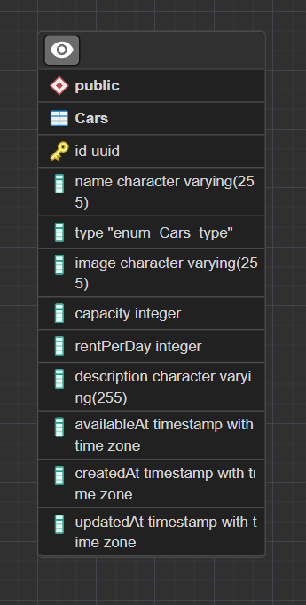

# Simple CRUD application for rental cars

All the documentation for the API can be found on [Postman](https://www.postman.com/ccrsxx/workspace/rental-car).

The API is deployed on [https://dev.risalamin.com](https://dev.risalamin.com), you can hit the endpoints directly from there. It might not be available on the future, so you can also run it locally.

Here's the ERD for the database:

<p align='center'>
  
</p>

## Development

Here are the steps to run the project locally.

1. Clone the repository

   ```bash
   git clone https://github.com/ccrsxx/binar-academy.git
   ```

1. Change directory to the project

   ```bash
   cd binar-academy/public/assignments/chapter_04/challenge_01
   ```

1. Install dependencies

   ```bash
   npm i
   ```

1. Check you config in [db/config/database.js](./db/config/database.js). Make sure the username and password match your local database.

1. Create DB if not exists

   ```bash
   npm run db:create
   ```

1. Run migrations

   ```bash
   npm run db:migrate
   ```

1. Run seeders

   ```bash
   npm run db:seed
   ```

1. Run the app

   ```bash
   npm run dev
   ```
